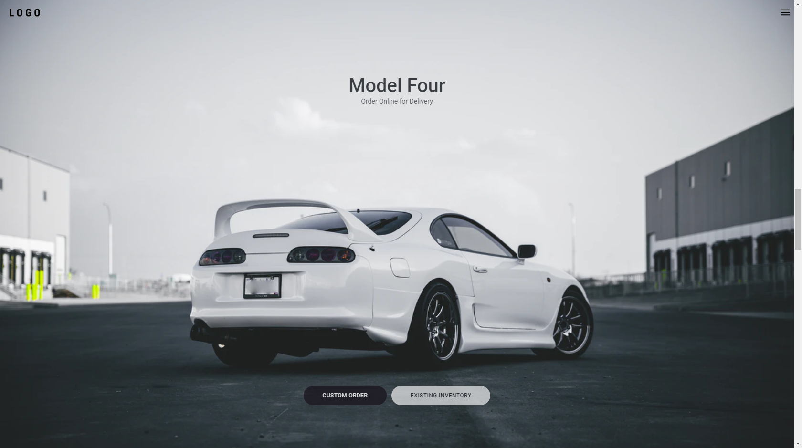

<h1 align="center">
    
</h1>


<h1 align="center">Tesla clone homepage 🏎</h1>

<h4 align="center">

[View demo](#-demonstration) · [Report bug](#-demonstration)
    
</h4>

<h2> 📘 Index </h2> 

- [👨‍🏫 About](#-about)
- [🚀 Technology](#-technology)
  - [📚 Libraries](#-libraries)
- [🎬 Demonstration](#-demonstration)
- [☕ Prerequisites](#-prerequisites)
- [🔧 Installing](#-installing)
- [💿 Using](#-using)
- [📮 Contributing](#-contributing)
- [🤟 Collaborators](#-collaborators)
  - [😎 Become a contributor](#-become-a-contributor)
- [📜 License](#-license)

## 👨‍🏫 About 

Project developed from a video on the [Rocketseat YouTube channel. 💜](https://www.youtube.com/channel/UCSfwM5u0Kce6Cce8_S72olg)

- [x] [Video: Homepage da Tesla com ReactJS | UI Clone #14](https://www.youtube.com/watch?v=Mf4Se4ZGcG8) 🎥

## 🚀 Technology 

- [x] [ReactJS](https://reactjs.org/)
- [x] [Framer Motion](https://www.framer.com/motion/) 

### 📚 Libraries 

- [styled-components](https://styled-components.com/)

## 🎬 Demonstration



## ☕ Prerequisites

Before getting your hands dirty, make sure you meet the following requirements: 

- [ ] Have a recent version of Node installed
- [ ] Have a recent version of Yarn installed

## 🔧 Installing 

To install, follow the steps:

```bash
## Installing dependencies

yarn install 

## or

npm install
```

## 💿 Using

To use, follow the steps:

```bash
## Running project

yarn start 

## or

npm start
```

## 📮 Contributing 

If this is your first contribution, [see the following tutorial.](https://github.com/firstcontributions/first-contributions)

## 🤟 Collaborators 

We thank the following developers who contributed:  

<table>
  <tr>
    <td align="center">
      <a href="#">
         <br>
        <sub>
          <b>Leonardo Campello</b>
        </sub>
      </a>
    </td>
  </tr>
</table>

### 😎 Become a contributor  

Would you like to be part of this project? Click [HERE](https://github.com/firstcontributions/first-contributions) and read the instructions to contribute.

## 📜 License

Made in 2020. This project is under the [MIT license.](./LICENSE)

<h2> Made with 💚 by Leonardo Campello </h2>